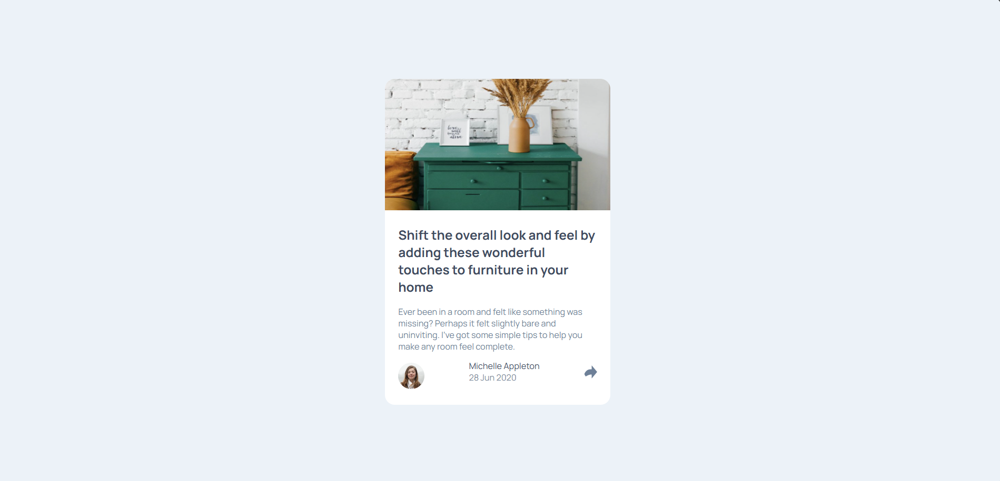
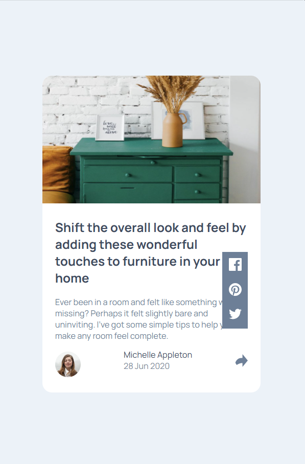

# Frontend Mentor - Article preview component solution

This is a solution to the [Article preview component challenge on Frontend Mentor](https://www.frontendmentor.io/challenges/article-preview-component-dYBN_pYFT). 

## Table of contents

  - [Links](#links)
  - [The challenge](#the-challenge)
  - [Screenshot](#screenshot)
  - [Built with](#built-with)
  - [Author](#author)

### Links

- Live Site URL: (https://ajinkya9834.github.io/Article-preview-component-practice/)

### The challenge

Users should be able to:

- create a card component with an image and description.
- click on share icon and see more options to share.

### Screenshot

- desktop-view:

- mobile-view

### Built with

- Semantic HTML5 markup
- CSS custom properties
- Flexbox
- Mobile-first workflow

## Author

-see my other challenges on Frontend Mentor:
       Frontend Mentor - (https://www.frontendmentor.io/profile/Ajinkya9834)

- My Linkedin profile - (www.linkedin.com/in/ajinkya-hajare)

